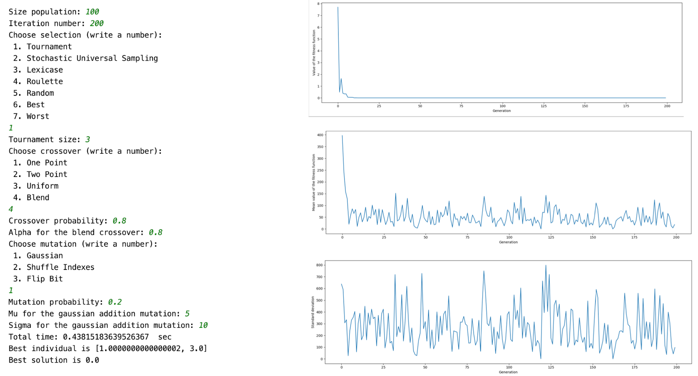

# Genetic_algorithm_DEAP_library
Genetic Algorithms solving the problem of optimization - minimization Booth function

## Table of contents
* [Technologies](#technologies)
* [Results](#Results)

## Technologies
* Python 3.7
* Anaconda (Jupyter Notebook)

## Modules
* deap
* matplotlib

## Example
The algorithm in presented configuration returned the solution constituting the target and the searched value of 0.0 as the result of minimizing the function, which was found in (1.0, 3.0).

  
 

